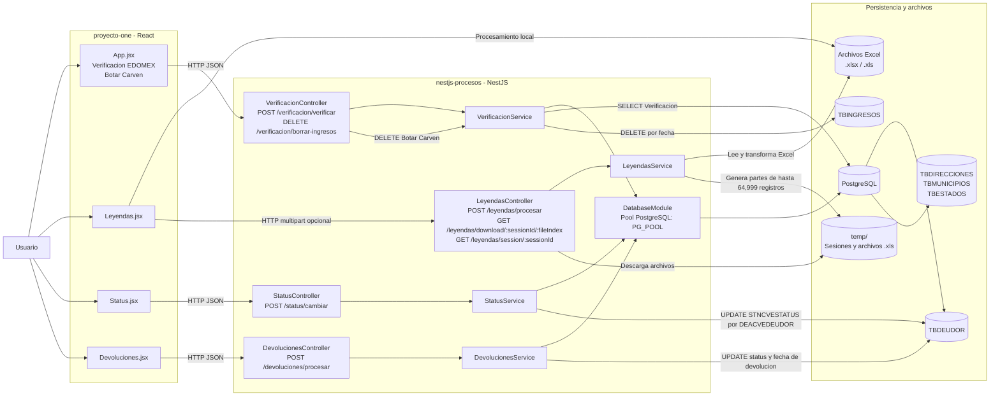

```mermaid
flowchart LR
    U[Usuario]

    subgraph FRONT[proyecto-one - React]
        APP[App.jsx\nVerificacion EDOMEX\nBotar Carven]
        LEY_UI[Leyendas.jsx]
        STATUS_UI[Status.jsx]
        DEV_UI[Devoluciones.jsx]
    end

    subgraph API[nestjs-procesos - NestJS]
        V_CTRL[VerificacionController\nPOST /verificacion/verificar\nDELETE /verificacion/borrar-ingresos]
        L_CTRL[LeyendasController\nPOST /leyendas/procesar\nGET /leyendas/download/:sessionId/:fileIndex\nGET /leyendas/session/:sessionId]
        S_CTRL[StatusController\nPOST /status/cambiar]
        D_CTRL[DevolucionesController\nPOST /devoluciones/procesar]

        V_SVC[VerificacionService]
        L_SVC[LeyendasService]
        S_SVC[StatusService]
        D_SVC[DevolucionesService]
        DB[DatabaseModule\nPool PostgreSQL: PG_POOL]
    end

    subgraph DATA[Persistencia y archivos]
        PG[(PostgreSQL)]
        TB1[(TBDEUDOR)]
        TB2[(TBINGRESOS)]
        TBL[(TBDIRECCIONES\nTBMUNICIPIOS\nTBESTADOS)]
        TEMP[(temp/\nSesiones y archivos .xls)]
        XLS[(Archivos Excel\n.xlsx / .xls)]
    end

    U --> APP
    U --> LEY_UI
    U --> STATUS_UI
    U --> DEV_UI

    APP -->|HTTP JSON| V_CTRL
    LEY_UI -->|Procesamiento local| XLS
    LEY_UI -->|HTTP multipart opcional| L_CTRL
    STATUS_UI -->|HTTP JSON| S_CTRL
    DEV_UI -->|HTTP JSON| D_CTRL

    V_CTRL --> V_SVC
    V_SVC --> DB
    V_SVC -->|SELECT Verificacion| PG
    PG --> TB1
    PG --> TBL

    V_CTRL -->|DELETE Botar Carven| V_SVC
    V_SVC -->|DELETE por fecha| TB2

    L_CTRL --> L_SVC
    L_SVC -->|Lee y transforma Excel| XLS
    L_SVC -->|Genera partes de hasta 64,999 registros| TEMP
    L_CTRL -->|Descarga archivos| TEMP

    S_CTRL --> S_SVC
    S_SVC --> DB
    S_SVC -->|UPDATE STNCVESTATUS por DEACVEDEUDOR| TB1

    D_CTRL --> D_SVC
    D_SVC --> DB
    D_SVC -->|UPDATE status y fecha de devolucion| TB1

    DB --> PG
```
