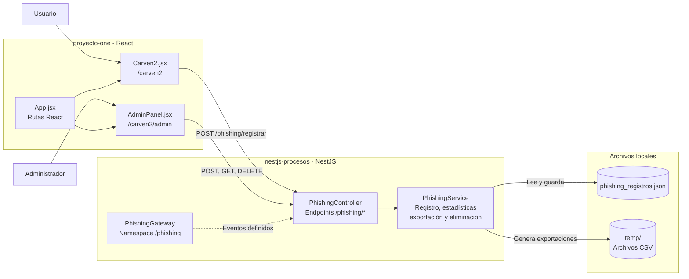

```mermaid
flowchart LR
    U[Usuario]
    A[Administrador]

    subgraph FRONT[proyecto-one - React]
        C[Carven2.jsx\n/carven2]
        P[AdminPanel.jsx\n/carven2/admin]
        R[App.jsx\nRutas React]
    end

    subgraph BACK[nestjs-procesos - NestJS]
        CTRL[PhishingController\nEndpoints /phishing/*]
        SVC[PhishingService\nRegistro, estadísticas\nexportación y eliminación]
        GW[PhishingGateway\nNamespace /phishing]
    end

    subgraph DATA[Archivos locales]
        JSON[(phishing_registros.json)]
        TEMP[(temp/\nArchivos CSV)]
    end

    U --> C
    A --> P
    R --> C
    R --> P

    C -->|POST /phishing/registrar| CTRL
    P -->|POST, GET, DELETE| CTRL

    CTRL --> SVC
    SVC -->|Lee y guarda| JSON
    SVC -->|Genera exportaciones| TEMP
    GW -.->|Eventos definidos| CTRL
```
