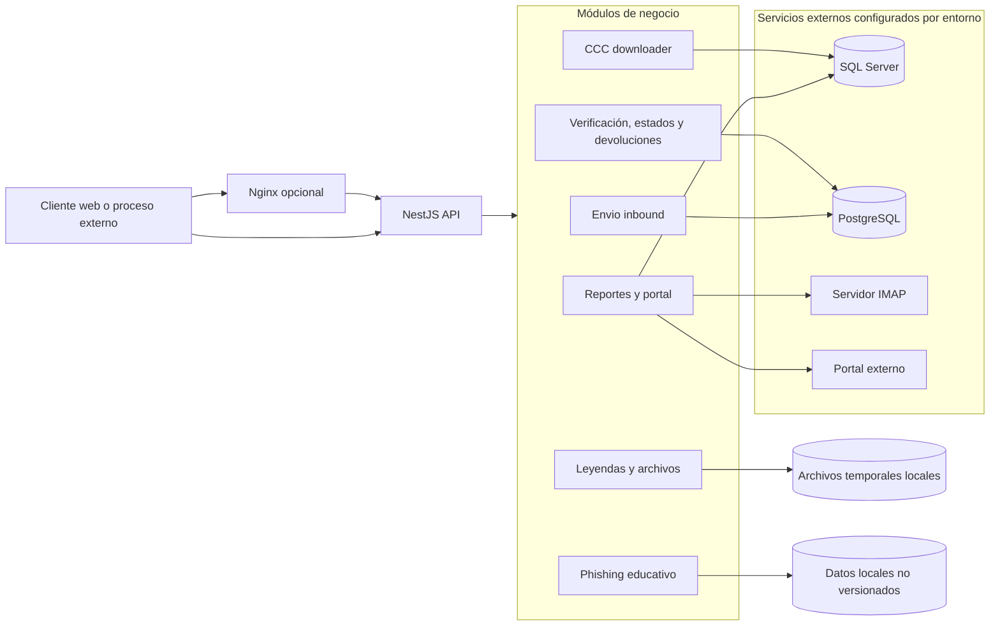

# nestjs-procesos

Backend modular construido con **NestJS**, **TypeScript** y **Node.js** para automatizar procesos de integración, reportes, archivos y operaciones administrativas.

> Este repositorio está preparado para publicar código y documentación sin credenciales reales. Los valores de conexión deben existir únicamente en variables de entorno locales o en un gestor de secretos.

## Contenido

- [Capacidades](#capacidades)
- [Arquitectura](#arquitectura)
- [Requisitos](#requisitos)
- [Instalación](#instalación)
- [Configuración](#configuración)
- [Ejecución](#ejecución)
- [Módulos y endpoints](#módulos-y-endpoints)
- [Estructura del proyecto](#estructura-del-proyecto)
- [Seguridad y privacidad](#seguridad-y-privacidad)
- [Pruebas y compilación](#pruebas-y-compilación)
- [Mantenimiento](#mantenimiento)
- [Licencia](#licencia)

## Capacidades

- Procesamiento de reportes inbound desde portal y bases de datos SQL.
- Generación y transformación de archivos CSV, Excel y ZIP.
- Integraciones HTTP, IMAP y SMTP mediante configuración externa.
- Tareas programadas con `@nestjs/schedule` y `node-cron`.
- Procesamiento de leyendas, devoluciones, estados y verificaciones.
- Descarga automatizada de reportes mediante Selenium.
- Módulo de simulación de phishing educativo que registra únicamente metadatos de pruebas; no almacena contraseñas.
- Exportación de resultados y comunicación en tiempo real mediante WebSockets.

## Arquitectura



El detalle de los flujos se encuentra en [DIAGRAMA_ARQUITECTURA.md](DIAGRAMA_ARQUITECTURA.md) y [DIAGRAMA_ARQUITECTURA_PHISHING.md](DIAGRAMA_ARQUITECTURA_PHISHING.md).

## Requisitos

- Node.js 20 o superior.
- npm 10 o superior.
- Acceso de red a las bases, portales o buzones requeridos por los módulos que se vayan a ejecutar.
- Credenciales suministradas mediante variables de entorno, nunca en el código.

## Instalación

```bash
git clone <URL-del-repositorio>
cd nestjs-procesos
npm install
```

Crea la configuración local a partir de [.env.example](.env.example):

```bash
copy .env.example .env
```

En Linux o macOS:

```bash
cp .env.example .env
```

Completa `.env` con valores de tu entorno. El archivo está excluido por `.gitignore` y no debe subirse al repositorio.

## Configuración

Las variables principales son:

| Grupo                    | Variables                                                                                              |
| ------------------------ | ------------------------------------------------------------------------------------------------------ |
| Aplicación               | `PORT`                                                                                                 |
| Base principal           | `DB_SERVER`, `DB_PORT`, `DB_USER`, `DB_PASSWORD`, `DB_DATABASE`                                        |
| Base de reportes         | `DB_ORIGEN_USER`, `DB_ORIGEN_PASSWORD`, `DB_ORIGEN_SERVER`, `DB_ORIGEN_DATABASE`, `DB_ORIGEN_PORT`     |
| Portal                   | `PORTAL_BASE_URL`, `PORTAL_USER`, `PORTAL_PASSWORD`                                                    |
| CCC                      | `CCC_USERNAME`, `CCC_PASSWORD`, `DB_HOST2`, `DB_PORT2`, `DB_USERNAME2`, `DB_PASSWORD2`, `DB_DATABASE2` |
| Administración educativa | `PHISHING_ADMIN_PASSWORD`                                                                              |
| IMAP                     | `IMAP_HOST`, `IMAP_PORT`, `IMAP_USERNAME`, `IMAP_PASSWORD`, `IMAP_TLS`                                 |

No se incluyen hosts, usuarios ni nombres de bases reales. Usa un gestor de secretos en producción y rota cualquier credencial que haya estado expuesta anteriormente.

## Ejecución

Para una demostración visual sin conexiones externas, define `DEMO_MODE=true` en `.env`. Este modo carga únicamente el módulo educativo y no inicializa bases de datos, portales ni tareas de integración:

```dotenv
DEMO_MODE=true
PORT=3001
PHISHING_ADMIN_PASSWORD=CAMBIAR_EN_ENTORNO_LOCAL
```

Después inicia normalmente:

Desarrollo con recarga automática:

```bash
npm run start:dev
```

Producción:

```bash
npm run build
npm run start:prod
```

El puerto se toma de `PORT`; el valor habitual de ejemplo es `3001`.

## Módulos y endpoints

| Área               | Endpoints principales                                                                              |
| ------------------ | -------------------------------------------------------------------------------------------------- |
| Verificación       | `POST /verificacion/verificar`, `GET /verificacion`                                                |
| Inbound            | `POST /envio-inbound/generar`, `GET /envio-inbound/probar/:fecha`                                  |
| Reportes           | `GET /api/reporte/completo/:fecha`, `GET /api/reporte/excel/:fecha`, `GET /api/reporte/sql/:fecha` |
| CCC                | `POST /ccc-downloader/ejecutar`, `POST /ccc-downloader/cuenta`, `GET /ccc-downloader/cuentas`      |
| Leyendas           | `POST /leyendas/procesar`, `GET /leyendas/download/:sessionId/:fileIndex`                          |
| Estados            | `POST /status/cambiar`                                                                             |
| Devoluciones       | `POST /devoluciones/procesar`                                                                      |
| Phishing educativo | `POST /phishing/registrar`, `GET /phishing/stats`, `GET /phishing/registros`                       |

Las rutas de eliminación y exportación del módulo educativo deben protegerse con autenticación, autorización y control de acceso en el entorno donde se desplieguen.

## Estructura del proyecto

```text
.
├── apps/nest-js_procesos/src/
│   ├── ccc-downloader/       # Descarga y procesa reportes CCC
│   ├── envio-inbound/        # Generación de reportes inbound
│   ├── phishing/             # Simulación educativa sin contraseñas
│   ├── reporte/              # Portal y consultas SQL
│   ├── leyendas/             # Procesamiento de Excel
│   ├── status/               # Actualización de estados
│   ├── devoluciones/         # Procesamiento de devoluciones
│   └── verificacion/         # Consultas de verificación
├── .env.example              # Plantilla pública de configuración
├── nest-cli.json             # Configuración del monorepo NestJS
├── package.json              # Scripts y dependencias
├── nginx-1.30.1/conf/        # Proxy local de ejemplo
└── tsconfig*.json            # Configuración TypeScript
```

Los perfiles de navegador, bases locales, exportaciones, archivos temporales y registros de ejecución están excluidos del repositorio.

## Seguridad y privacidad

- No guardes contraseñas, tokens, cookies, claves privadas ni datos personales en Git.
- El módulo educativo descarta el campo de contraseña y solo conserva metadatos necesarios para la prueba autorizada.
- No utilices datos reales para simulaciones de phishing.
- Usa HTTPS, autenticación robusta, autorización por rol y límites de intentos en endpoints administrativos.
- Revisa el historial de Git si una credencial llegó a confirmarse; eliminar el archivo actual no elimina esa exposición histórica.
- Rota inmediatamente cualquier secreto que haya aparecido en un commit, log, exportación o respaldo.
- Antes de publicar, revisa `git status`, archivos ignorados y el contenido de los commits.

## Pruebas y compilación

```bash
npm run build
npm test
```

Las pruebas requieren las dependencias instaladas. Los módulos que conectan con servicios externos deben probarse con cuentas, bases y datos ficticios o aislados.

## Licencia

© 2026 Ian Marcel Castrejon Cuevas. Todos los derechos reservados.

Este proyecto y su código fuente son propiedad de Ian Marcel Castrejon Cuevas. Queda prohibida la reproducción, distribución, modificación o utilización del código, total o parcialmente, sin autorización previa del propietario.
